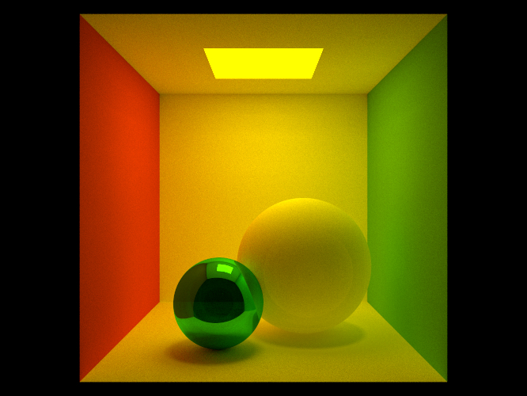

<p align="center">
  <a href="https://github.com/ZeusYang/TinySoftRenderer">
    
  </a>
  <h3 align="center">Aurora</h3>
<p align="center">

</p>
  <p align="center">
    An offline ray tracing-based renderer for fun
    <br />


## About The Project

Aurora, is a learning-oriented rendering system in the style of PBRT. Hence, this project were mostly ported from [pbrt-v3](https://github.com/mmp/pbrt-v3) with much customization and adjustment out of personal habits. I plan to develop this project as a long-term project. Learning by doing!


### Built With

This project is built with following third parties.
* [GLM](https://github.com/g-truc/glm) for fast algebra and math calculation
* [stb_image](https://github.com/nothings/stb) for image I/O
* [glog](https://github.com/google/glog) for logging and debuging
* [nlohmann_json](https://github.com/nlohmann/json) for parsing json file of the scene 


## Getting Started

### Prerequisites

 I build this project on Windows platform. Please make sure your system is equipped with the following softwares.  

- [cmake](https://cmake.org/)：at least version 3.5

* Microsoft visual studio 2017 or 2019
  

### Installation

Please compile the project for **x64 platform**.

1. Clone the repo
   ```sh
   git clone --recurse-submodules https://github.com/ZeusYang/Aurora.git
   ```
   
2. Use cmake to build the project：
   
   ```
   mkdir build
   cd build
   cmake ..
   make
   ```
   
   or using cmake-gui is ok.

Please make sure that clone the reposity with `--recurse-submodules` option. If you foget to run `git clone` with it, just type the command `git submodule update --init --recursive`.


## Usage

After successful compilation, run `Aurora.exe --help` in the command line could get the follwoing prompt:

```C++
usage: Aurora [<options>] <filename.json...>
Rendering options:
  --help               Print this help text.

Logging options:
  --logdir <dir>       Specify directory that log files should be written to.
                       Default: system temp directory (e.g. $TMPDIR or /tmp).

  --logtostderr        Print all logging messages to stderr.

  --minloglevel <num>  Log messages at or above this level (0 -> INFO,
                       1 -> WARNING, 2 -> ERROR, 3-> FATAL). Default: 0.

  --v <verbosity>      Set VLOG verbosity.
```

For example, in order to set the `scenes/cornellBox.json` as an input scene file, you should type the command as shown below:

```C++
Aurora.exe ./scenes/cornellBox.json
```

More features and scenes are planned.


## License

Distributed under the MIT License. See `LICENSE` for more information.


## Contact

yangwc3@mail2.sysu.edu.cn

